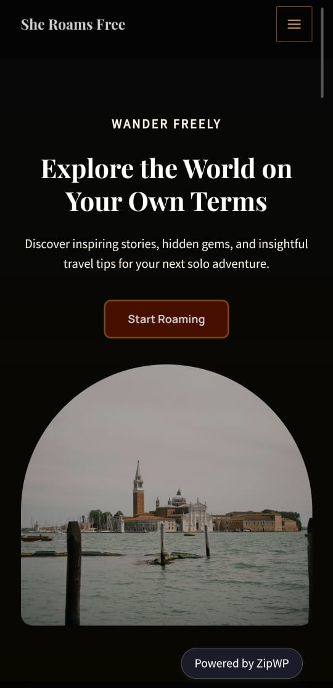

# She Roams Free 🌍✨

**She Roams Free** is a solo travel-themed WordPress blog designed to inspire women to explore the world on their own terms. Built using [ZipWP](https://zipwp.com/), this project focuses on storytelling, hidden gems, and insightful travel tips for solo adventurers.

---

## 🚀 Live Preview

> ⏳ *Temporary ZipWP preview URL (expires soon):*  
[Preview Site](https://tearful-thibault-69s.zipwp.xyz/?preview_id=15&preview_nonce=394df3c472&preview=true)

---

## 🛠️ Tech Stack

- **CMS:** WordPress
- **Builder:** ZipWP
- **Theme:** Travel blog template from ZipWP
- **Plugin Used:** All-in-One WP Migration (for backup/export)

---

## 📦 Export File

You can find the exported `.wpress` file in this repository.  
To reuse this project:

1. Install WordPress on your host/local setup.
2. Install the **All-in-One WP Migration** plugin.
3. Use **Import** option to upload the `.wpress` file and restore the full site.

---

## 🎯 Project Goals

- Build a clean, responsive travel blog.
- Share solo travel experiences and guides.
- Showcase ability to build and deploy WordPress websites.

---

## 📸 Preview Screenshot

>   

---

## 🙋‍♀️ About Me

Created by **Sanya Prabhakar**  
📸 Instagram: [@sanya__.28](https://instagram.com/sanya__.28)

---

## 📬 Contact

Want to collaborate or learn more? Drop a message on [Instagram](https://instagram.com/sanya__.28).

